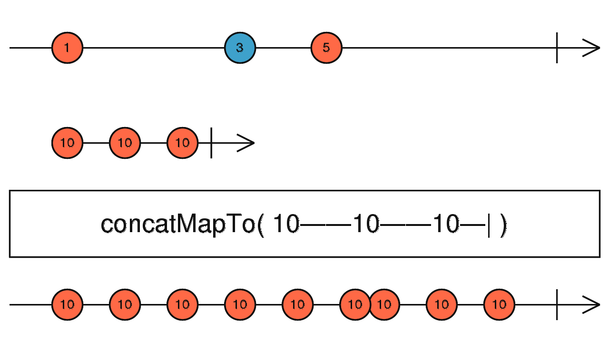

# concatMap、concatMapTo

## concatMap

```typescript
concatMap<T, R, O extends ObservableInput<any>>(
  project: (value: T, index: number) => O,
  resultSelector?: number | ((outerValue: T, innerValue: ObservedValueOf<O>,
  outerIndex: number, innerIndex: number) => R),
  concurrent: number = Infinity
): OperatorFunction<T, ObservedValueOf<O> | R>
```


concatMap 将每个值映射到一个 Observable，然后使用 concatAll 将所有这些内部 Observable 展平。

##### 使用例子

```typescript
import { fromEvent, interval } from 'rxjs';
import { concatMap, take } from 'rxjs/operators';

fromEvent(document, 'click')
  .pipe(concatMap(ev => interval(1000).pipe(take(2))))
  .subscribe(x => console.log(x));

// 0
// 1
// 0
// 1
// ...
```

<br/>

---

## concatMapTo

```typescript
concatMapTo<T, R, O extends ObservableInput<unknown>>(
  innerObservable: O,
  resultSelector?: (outerValue: T, innerValue: ObservedValueOf<O>, outerIndex: number,innerIndex: number) => R
): OperatorFunction<T, ObservedValueOf<O> | R>
```

concatMapTo 和 concatMap 操作符类似，不过 concatMapTo 是将一个值映射成一个固定的数据流，换句话说

```typescript
concatMapTo(y$);

// 等价于

concatMap(() => y$);
```



##### 使用例子

```typescript
import { fromEvent, interval } from 'rxjs';
import { concatMapTo, take } from 'rxjs/operators';

fromEvent(document, 'click')
  .pipe(concatMapTo(interval(1000).pipe(take(2))))
  .subscribe(x => console.log(x));

// 0
// 1
// 0
// 1
// ...
```

<br/><br/>

参考链接：

- [concatMap](https://rxjs.dev/api/operators/concatMap)
- [concatMapTo](https://rxjs.dev/api/operators/concatMapTo)
