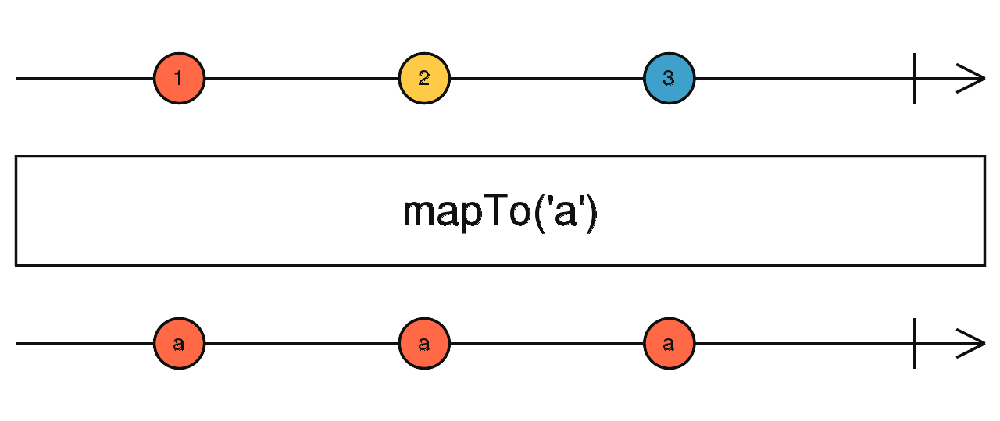

# map、mapTo

## map

```typescript
map<T, R>(project: (value: T, index: number) => R, thisArg?: any): OperatorFunction<T, R>
```


map 是 RxJS 中非常常用的一个操作符，它的作用很像 `Array.prototype.map` 用于将发射的值映射成另一个值

##### 使用例子

```typescript
import { of } from 'rxjs';
import { map } from 'rxjs/operators';

const source$ = of(1, 2, 3);

source$.pipe(map(num => num * 10)).subscribe(x => {
  console.log(x);
});

// 10
// 20
// 30
```

<br/>

---

## mapTo

```typescript
mapTo<R>(value: R): OperatorFunction<any, R>
```

mapTo 和 map 操作符类似，不过 mapTo 是映射成一个固定的值，换句话说

```typescript
mapTo(y);

// 等价于

map(() => y);
```



##### 使用例子

```typescript
import { of } from 'rxjs';
import { mapTo } from 'rxjs/operators';

const source$ = of(1, 2, 3);

source$
  .pipe(
    mapTo('a'), // 等价于map(() => 'a')
  )
  .subscribe(x => {
    console.log(x);
  });

// a
// a
// a
```

<br/><br/>

参考链接：

- [map](https://rxjs.dev/api/operators/map)
- [mapTo](https://rxjs.dev/api/operators/mapTo)
