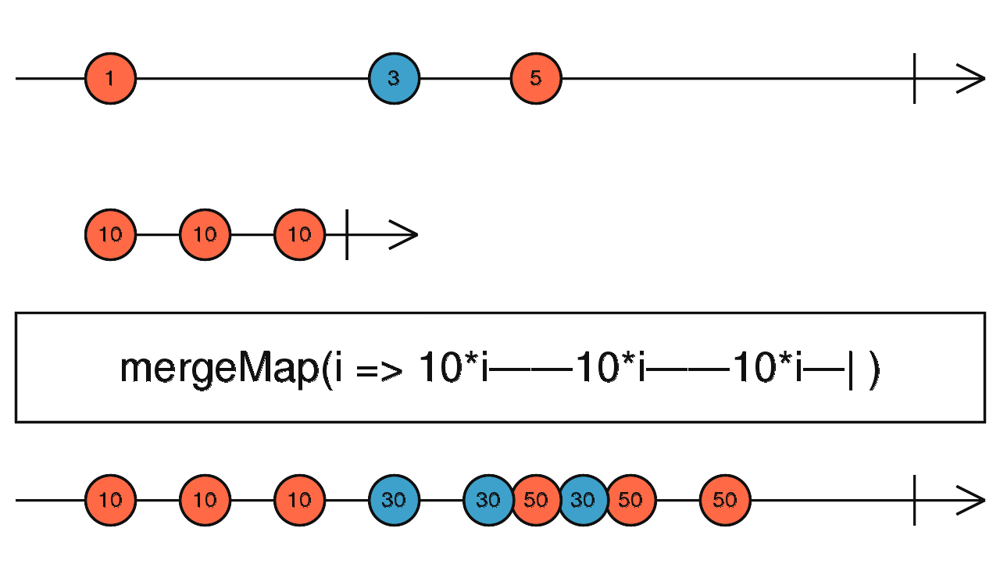
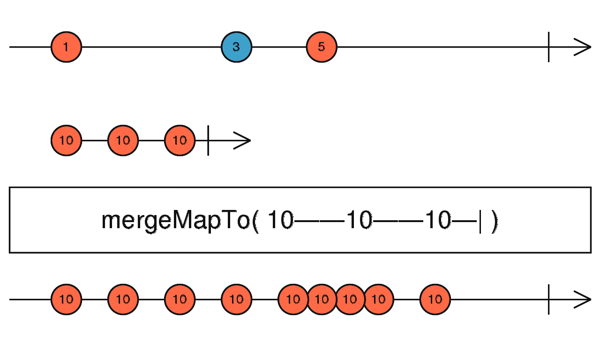

# mergeMap、mergeMapTo

## mergeMap

```typescript
mergeMap<T, R, O extends ObservableInput<any>>(
  project: (value: T, index: number) => O,
  resultSelector?: number | ((outerValue: T, innerValue: ObservedValueOf<O>,
  outerIndex: number, innerIndex: number) => R),
  concurrent: number = Infinity
): OperatorFunction<T, ObservedValueOf<O> | R>
```



mergeMap 将每个值映射到一个 Observable，然后使用 mergeAll 将所有这些内部 Observable 展平。

##### 使用例子

```typescript
import { of, interval } from 'rxjs';
import { mergeMap, map } from 'rxjs/operators';

const letters = of('a', 'b', 'c');
const result = letters.pipe(
  mergeMap(x => interval(1000).pipe(map(i => x + i))),
);
result.subscribe(x => console.log(x));

// a0
// b0
// c0
// a1
// b1
// c1
// ...
```

<br/>

---

## mergeMapTo

```typescript
mergeMapTo<T, R, O extends ObservableInput<unknown>>(
  innerObservable: O,
  resultSelector?: number | ((outerValue: T, innerValue: ObservedValueOf<O>,
  outerIndex: number, innerIndex: number) => R),
  concurrent: number = Infinity
): OperatorFunction<T, ObservedValueOf<O> | R>
```

mergeMapTo 和 mergeMap 操作符类似，不过 mergeMapTo 是将一个值映射成一个固定的数据流，换句话说

```typescript
mergeMapTo(y$);

// 等价于

mergeMap(() => y$);
```



##### 使用例子

```typescript
import { fromEvent, interval } from 'rxjs';
import { mergeMapTo } from 'rxjs/operators';

fromEvent(document, 'click')
  .pipe(mergeMapTo(interval(1000)))
  .subscribe(x => console.log(x));
```

<br/><br/>

参考链接：

- [mergeMap](https://rxjs.dev/api/operators/mergeMap)
- [mergeMapTo](https://rxjs.dev/api/operators/mergeMapTo)
