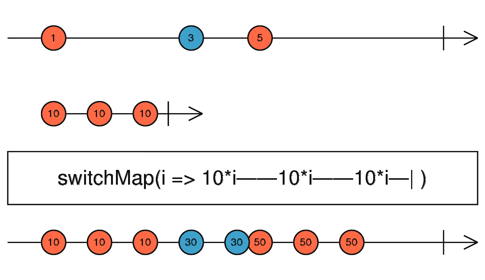
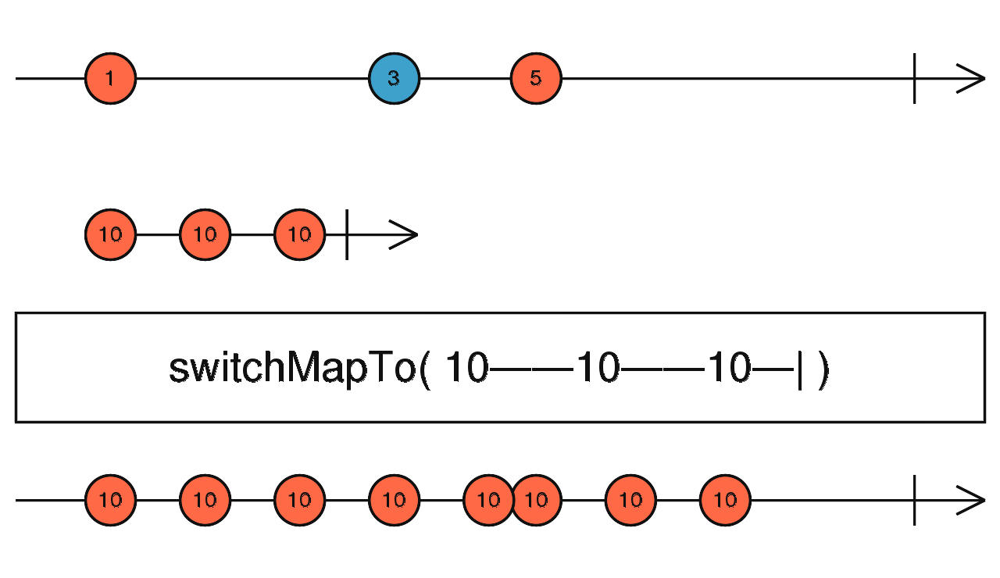

# switchMap、switchMapTo

## switchMap

```typescript
switchMap<T, R, O extends ObservableInput<any>>(
  project: (value: T, index: number) => O,
  resultSelector?: (outerValue: T, innerValue: ObservedValueOf<O>,
  outerIndex: number, innerIndex: number) => R
): OperatorFunction<T, ObservedValueOf<O> | R>
```



switchMap 可以将一个值映射成一个内部 Observable，然后将所有这些内部 Observable 展平。并且它有一个重要的特点是当一个新的内部 Observable 被发射时，`switchMap`会 停止从先前发射的内部 Observable 发射项目并开始从新的内部 Observable 发射项目。

> 注意看上图中在源数据流发出 5 的时候，会将前面的刚映射出来的数据流（30-30）停止掉，并使用新的数据流（50-50-50）

##### 使用例子

每次点击生成一个新的 interval 数据流

```typescript
import { fromEvent, interval } from 'rxjs';
import { switchMap } from 'rxjs/operators';

fromEvent(document, 'click')
  .pipe(switchMap(() => interval(1000)))
  .subscribe(x => console.log(x));
```

举一个更加贴近实际的场景：每次点击按钮就发送请求，如果上一个请求还没结束，新的请求又发出去就使用新的返回数据

```tsx
import React, { useEffect, useRef, useState } from 'react';
import { fromEvent, of } from 'rxjs';
import { delay, switchMap } from 'rxjs/operators';

// 模拟一个延时 500 毫秒返回的 API
function getResult() {
  return of(`${new Date().toLocaleString()}`).pipe(delay(500));
}

export default function Demo() {
  const ref = useRef(null);
  const [result, setResult] = useState('');

  useEffect(() => {
    const sub = fromEvent(ref.current!, 'click')
      .pipe(switchMap(() => getResult()))
      .subscribe(x => {
        setResult(x);
      });

    return () => {
      sub.unsubscribe();
    };
  }, [result]);

  return (
    <div ref={ref}>
      <button>click me</button>
      <div>result:{result}</div>
    </div>
  );
}
```

<br/>

---

## switchMapTo

```typescript
switchMapTo<T, R, O extends ObservableInput<unknown>>(
  innerObservable: O,
  resultSelector?: (outerValue: T, innerValue: ObservedValueOf<O>,
  outerIndex: number, innerIndex: number) => R
): OperatorFunction<T, ObservedValueOf<O> | R>
```

switchMapTo 和 switchMap 操作符类似，不过 switchMapTo 是将一个值映射成一个固定的数据流，换句话说

```typescript
switchMapTo(y$);

// 等价于

switchMap(() => y$);
```



##### 使用例子

```typescript
import { fromEvent, interval } from 'rxjs';
import { switchMapTo } from 'rxjs/operators';

fromEvent(document, 'click')
  .pipe(switchMapTo(interval(1000)))
  .subscribe(x => console.log(x));
```

<br/><br/>

参考链接：

- [switchMap](https://rxjs.dev/api/operators/switchMap)
- [switchMapTo](https://rxjs.dev/api/operators/switchMapTo)
