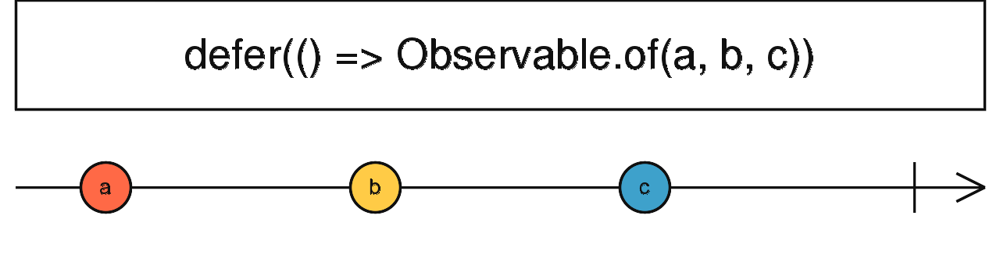

# defer

```ts
defer<R extends ObservableInput<any>>(observableFactory: () => R): Observable<ObservedValueOf<R>>
```



defer 用于惰性创建 Observable，即只有在它被订阅时才创建。

#### 使用例子

```ts
import { defer, of } from 'rxjs';

let signal = 0;

const number$ = defer(() => {
  return signal === 0 ? of(0) : of(1);
});

signal = 0;

number$.subscribe(x => console.log(x)); // 0

signal = 1;

number$.subscribe(x => console.log(x)); // 1
```

<br/>

参考资料：

- [defer](http://localhost:8000/#/streams/create/defer)
