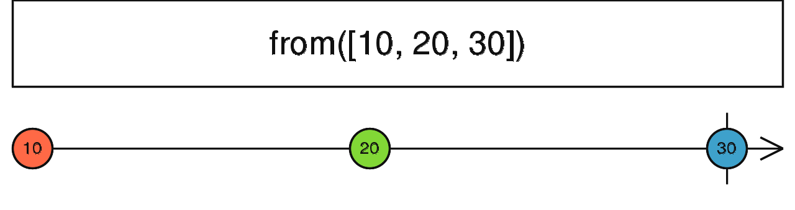

# from

<Alert type="info">

从数组、类似数组的对象、Promise、可迭代对象或类似 Observable 的对象创建一个 Observable

</Alert>

```ts
from<T>(input: ObservableInput<T>, scheduler?: SchedulerLike): Observable<T>
```



### 使用例子

##### 将数组转换为 Observable

```ts
import { from } from 'rxjs';

const array = [1, 2, 32];

from(array).subscribe(x => console.log(x));

// 1
// 2
// 3
```

##### 将 Promise 转换为 Observable

```typescript
import { from } from 'rxjs';

function getMessage() {
  return new Promise(resolve => {
    setTimeout(() => {
      resolve('hello world');
    }, 2000);
  });
}
const promise = getMessage();

from(promise).subscribe(res => console.log(res));

// hello world
```

##### 将迭代器转换为 Observable

```ts
import { from } from 'rxjs';
import { take } from 'rxjs/operators';

function* getNumber() {
  let i = 1;
  while (true) {
    yield i;
    i += 1;
  }
}

const iterator = getNumber();

from(iterator)
  .pipe(take(5))
  .subscribe(x => console.log(x));

// 1
// 2
// 3
// 4
// 5
```

<br/>

参考资料：

- [from](https://rxjs.dev/api/index/function/from)
