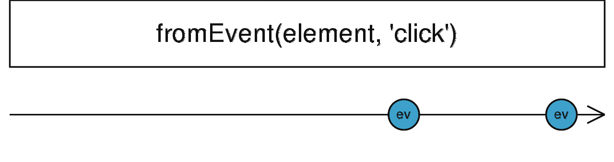

# fromEvent

<Alert type="info">

从 DOM 事件、Node.js EventEmitter 事件或其他事件创建一个 Observable

</Alert>

```ts
fromEvent<T>(target: any, eventName: string, options?: EventListenerOptions | ((...args: any[]) => T), resultSelector?: (...args: any[]) => T): Observable<T>
```

```typescript
interface EventListenerOptions {
  capture?: boolean;
  passive?: boolean;
  once?: boolean;
}
```



`fromEvent` 接受事件目标作为第一个参数，它是一个具有注册事件处理函数方法的对象。事件类型的字符串作为第二个参数。`fromEvent` 支持以下几种类型的可监听对象：

1. DOM 风格：具有 `addEventListener` 和 `removeEventListener`方法的对象。
2. Nodejs EventEmitter 风格：具有 `addListener` 和 `removeListener` 方法的对象。
3. JQuery 风格：具有 `on` 和 `off`方法的对象。

除此之外如果你想实现其它非标准自定义事件目标，你可以使用可扩展性更强的 [fromEventPattern](/streams/create/from-event)。

值得一提的是实际上 RxJS 是通过 [duck typing](https://zh.wikipedia.org/zh-hans/%E9%B8%AD%E5%AD%90%E7%B1%BB%E5%9E%8B) 检测的，也就是说只要你的对象实现了对应接口就可以被 fromEvent 接受，这一点在源码中可以很容易看出

```typescript
export function fromEvent<T>(
  target: any,
  eventName: string,
  options?: EventListenerOptions | ((...args: any[]) => T),
  resultSelector?: (...args: any[]) => T,
): Observable<T> {
  // 将三种风格类型的事件处理函数映射成统一的 add 和 remove
  const [add, remove] = isEventTarget(target)
    ? eventTargetMethods.map(methodName => (handler: any) =>
        target[methodName](eventName, handler, options as EventListenerOptions),
      )
    : isNodeStyleEventEmitter(target)
    ? nodeEventEmitterMethods.map(toCommonHandlerRegistry(target, eventName))
    : isJQueryStyleEventEmitter(target)
    ? jqueryMethods.map(toCommonHandlerRegistry(target, eventName))
    : [];

  // 如果是数组的话就使用 mergeMap 拍平
  if (!add) {
    if (isArrayLike(target)) {
      return mergeMap((subTarget: any) =>
        fromEvent(subTarget, eventName, options as EventListenerOptions),
      )(internalFromArray(target)) as Observable<T>;
    }
  }

  if (!add) {
    throw new TypeError('Invalid event target');
  }

  return new Observable<T>(subscriber => {
    const handler = (...args: any[]) =>
      subscriber.next(1 < args.length ? args : args[0]);
    add(handler);
    return () => remove!(handler);
  });
}
```

源码位置：[src/internal/observable/fromEvent.ts#L251](https://github.com/ReactiveX/rxjs/blob/4f4ac0074b4bc8aead728e2fa7aa0a9061f56f0b/src/internal/observable/fromEvent.ts#L251)

### 使用例子

##### 监听 DOM 事件

```ts
import { fromEvent } from 'rxjs';

const link = document.getElementById('a');

fromEvent(link, 'click', {
  capture: false,
  passive: true,
  once: true,
}).subscribe(() => {
  console.log('click');
});
```

##### 监听 DOM 列表事件

```typescript
import { fromEvent } from 'rxjs';

const linkList = document.getElementsByClassName('a');

fromEvent(linkList, 'click').subscribe(() => {
  console.log('click');
});
```

<br/>

参考资料：

- [fromEvent](https://rxjs.dev/api/index/function/fromEvent)
