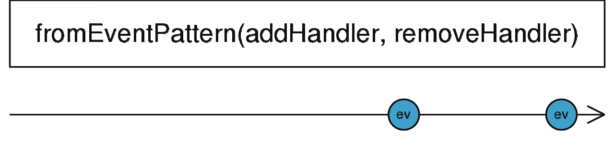

# **fromEventPattern**

<Alert type="info">

从任意可监听事件创建一个 Observable

</Alert>

```ts
fromEventPattern<T>(addHandler: (handler: NodeEventHandler) => any, removeHandler?: (handler: NodeEventHandler, signal?: any) => void, resultSelector?: (...args: any[]) => T): Observable<T | T[]>
```



fromEventPattern 接受一个 `addHandler` 事件处理函数作为第一个参数，该函数将被注入事件参数，`addHandler`每当订阅产生时被调用。

如果你可监听事件 API 允许取消注册事件处理函数，可以传递给 `fromEventPattern` 另一个函数 `removeHandler` 作为第二个参数，`removeHandler` 在取消订阅时被调用。

fromEventPattern 相比 [formEvent](/streams/create/from-event) 虽然代码繁琐一些，但是可扩展性更强，它可以支持任意接口的可监听事件，换句话说所有 [formEvent](/streams/create/from-event) 都可以转换为 fromEventPattern 的写法，比如下面这个例子

### 使用例子

##### 监听 DOM 事件（fromEvent 写法）

```typescript
import { fromEvent } from 'rxjs';

fromEvent(document, 'click').subscribe(x => console.log(x));
```

##### 监听 DOM 事件（fromEventPattern 写法）

```ts
import { fromEventPattern } from 'rxjs';

function addClickHandler(handler) {
  document.addEventListener('click', handler);
}

function removeClickHandler(handler) {
  document.removeEventListener('click', handler);
}

fromEventPattern(addClickHandler, removeClickHandler).subscribe(x =>
  console.log(x),
);
```

##### <br/>

参考资料：

- [fromEventPattern](https://rxjs.dev/api/index/function/fromEventPattern)
