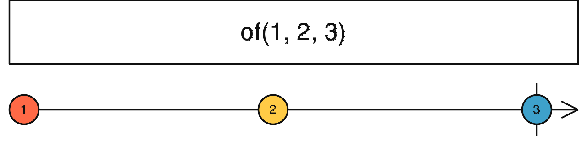

# of

```ts
of<T>(...args: (SchedulerLike | T)[]): Observable<T>
```



of 可以将任意值转换为 Observable。

#### 使用例子

```ts
import { of } from 'rxjs';

of(1, 2, 3).subscribe(x => console.log(x));

// 1
// 2
// 3
```

<br/>

参考资料：

- [of](https://rxjs.dev/api/index/function/of)
