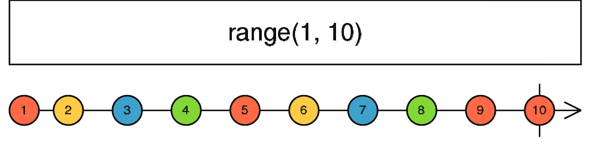

# range

```ts
range(start: number, count?: number, scheduler?: SchedulerLike): Observable<number>
```



range 用于创建一个发出指定范围内的数字序列的 Observable。

#### 使用例子

```ts
import { range } from 'rxjs';

const numbers = range(1, 3);

numbers.subscribe(x => console.log(x));

// 1
// 2
// 3
```

<br/>

参考资料：

- [range](http://localhost:8000/#/streams/create/range)
