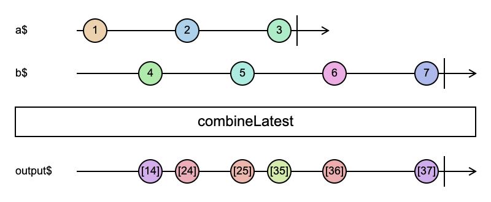

# combineLatest

```typescript
combineLatest<O extends ObservableInput<any>, R>(...args: any[]): Observable<R> | Observable<ObservedValueOf<O>[]>
```


combineLatest 会将多个数据流最新推送的值按顺序组装成一个组合再推送的数据流（output\$）

1. 任意数据流没有推送第一个值，output\$ 都不会推送值
2. 只有每个数据流都推送了第一个值，output\$ 才会发生第一次推送
   - 如果某个流提前推送，但是其他数据流还没推送，那么该提前推送的流将只会保留最新的一个值
3. 任意一个数据流发生错误，都会导致其他流结束
4. 所有数据流结束，output\$ 则结束
5. 如果某个数据流未推送值而直接结束，output\$ 则立刻结束

### 使用例子

```typescript
import { combineLatest, Observable, of } from 'rxjs';

const a$ = new Observable(subscriber => {
  // a$ 在 1s 的提前推送 1， 需要等到 b$ 在 2s 时候才会触发 combineLatest 第一次推送
  setTimeout(() => {
    subscriber.next(1);
  }, 1000);

  setTimeout(() => {
    subscriber.next(2);
  }, 3000);

  setTimeout(() => {
    subscriber.next(3);
  }, 5000);
});

const b$ = new Observable(subscriber => {
  setTimeout(() => {
    subscriber.next(4);
  }, 2000);

  setTimeout(() => {
    subscriber.next(5);
  }, 4000);

  // 5s 开始 a$ 的推送已经结束，因此从这里开始将一直使用 a$ 的最后一个推送也就是 3
  setTimeout(() => {
    subscriber.next(6);
  }, 6000);

  setTimeout(() => {
    subscriber.next(7);
  }, 8000);
});

combineLatest([a$, b$]).subscribe(x => {
  console.log(x);
});

// [1, 4]
// [2, 4]
// [2, 5]
// [3, 5]
// [3, 6]
// [3, 7]
```

上面这个例子的弹珠图如下



参考资料：

- [combineLatest](https://rxjs.dev/api/operators/combineLatest)

- [弹珠图](https://swirly.dev/?code=-1----2----3|%20title%20=%20a$%20----4----5----6----7|%20title%20=%20b$%20%3E%20combineLatest%20----a-b--c-d--e----f|%20title%20=%20output%20a%20:=%20[14]%20b%20:=%20[24]%20c%20:=%20[25]%20d%20:=%20[35]%20e%20:=%20[36]%20f%20:=%20[37])
