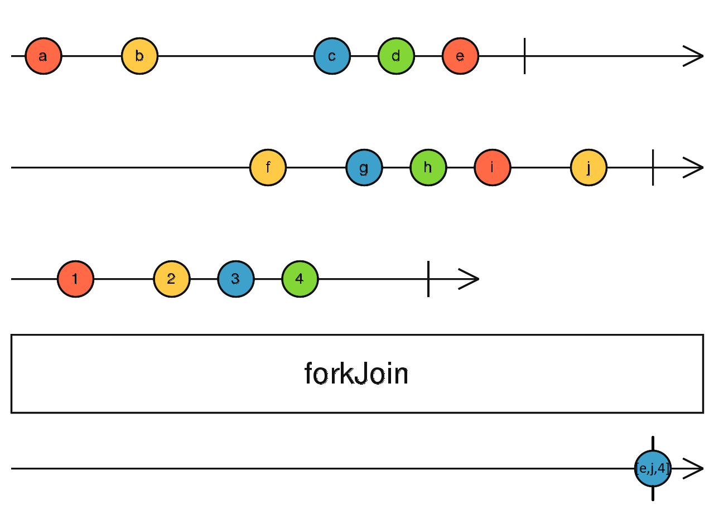

# forkJoin

```typescript
forkJoin(...args: any[]): Observable<any>
```



forkJoin 和 zip 很类似，不过它只取每个流的最后一个值。

1. 只有每个流都结束了，forkJoin 才会推送
2. 如果有某个流没有推送任何值而直接结束的话，forkJoin 也会直接结束，不会推送任何值，哪怕已经收集了其他流的值（参考例三）
3. 任意一个流发生错误，forkJoin 也会立刻出错并取消其它所有流的订阅（参考例四）

#### 使用例子

##### 传入数组

```typescript
import { forkJoin, of } from 'rxjs';

const output$ = forkJoin([of(1, 2, 3, 4), Promise.resolve(8), of(4, 5, 6, 7)]);

output$.subscribe({
  next: value => console.log(value),
  complete: () => console.log('complete'),
});

// [4,8,7]
// complete
```

##### 传入对象

```typescript
import { forkJoin, of } from 'rxjs';

const output$ = forkJoin({
  a: of(1, 2, 3, 4),
  b: Promise.resolve(8),
  c: of(4, 5, 6, 7),
});

output$.subscribe({
  next: value => console.log(value),
  complete: () => console.log('complete'),
});

// { a: 4, b: 8, c: 7 }
// complete
```

##### 不推送值而直接结束的流

```typescript
import { forkJoin, Observable, of } from 'rxjs';

// 一个啥也不干直接结束的流
const a$ = new Observable(subscriber => {
  subscriber.complete();
});

const b$ = of(1, 2, 3);
const c$ = of(4, 5, 6);

const output$ = forkJoin([a$, b$, c$]);

output$.subscribe({
  next: value => console.log(value),
  complete: () => console.log('complete'),
});

// complete
```

##### 流发生错误

```typescript
import { forkJoin, Observable, of } from 'rxjs';

// 1s 之后出错的一个流
const a$ = new Observable(subscriber => {
  subscriber.next(1);
  setTimeout(() => {
    subscriber.error();
  }, 1000);
});

const b$ = of(1, 2, 3);
const c$ = of(4, 5, 6);

const output$ = forkJoin([a$, b$, c$]);

output$.subscribe({
  next: value => console.log(value),
  error: () => console.error('error'),
  complete: () => console.log('complete'),
});

// error
```

参考资料：

- [forkJoin](https://rxjs.dev/api/index/function/forkJoin)
