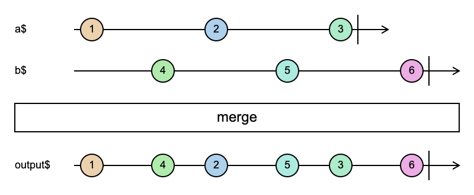

# merge

```typescript
merge(...args: (
  number |
  SchedulerLike |
  Observable<unknown> |
  InteropObservable<unknown> |
  AsyncIterable<unknown> |
  PromiseLike<unknown> |
  ArrayLike<...> |
  Iterable<...> |
  ReadableStreamLike<...>
  )[]
): Observable<unknown>
```


merge 会将多个数据流合并成一个流

1. 任意数据流推送值，merge 都会推送值
2. 只有所有流都完成了，merge 才会完成

#### 使用例子

```typescript
import { merge, Observable } from 'rxjs';

const a$ = new Observable(subscriber => {
  setTimeout(() => {
    subscriber.next(1);
  }, 1000);

  setTimeout(() => {
    subscriber.next(2);
  }, 3000);

  setTimeout(() => {
    subscriber.next(3);
  }, 5000);
});

const b$ = new Observable(subscriber => {
  setTimeout(() => {
    subscriber.next(4);
  }, 2000);

  setTimeout(() => {
    subscriber.next(5);
  }, 4000);

  setTimeout(() => {
    subscriber.next(6);
  }, 6000);
});

const output$ = merge(a$, b$);

output$.subscribe(x => {
  console.log(x);
});

// 1
// 4
// 2
// 5
// 3
// 6
```

上面这个例子的[弹珠图](https://swirly.dev/#?code=-1------2------3%7C%0Atitle%20=%20a$%0A%0A-----4------5------6%7C%0Atitle%20=%20b$%0A%0A%3E%20merge%0A%0A-1---4--2---5--3---6%7C%0Atitle%20=%20output$%0A)如下



参考资料：

- [merge](https://rxjs.dev/api/index/function/merge)
