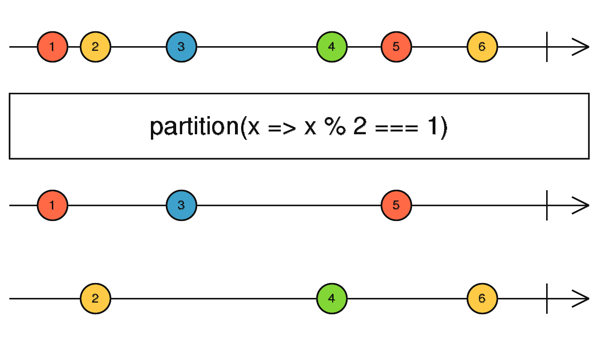

# partition

```typescript
partition<T>(
  source: ObservableInput<T>,
  predicate: (this: any, value: T, index: number) => boolean,
  thisArg?: any
): [Observable<T>, Observable<T>]
```



partition 会将一条数据流按照条件分割为两条数据流。

### 使用例子

```typescript
import { of, partition } from 'rxjs';

const source$ = of(1, 2, 3, 4, 5, 6);

const [evens$, odds$] = partition(source$, value => value % 2 === 0);

odds$.subscribe(x => console.log('odds', x));
evens$.subscribe(x => console.log('evens', x));

// odds 1
// odds 3
// odds 5
// evens 2
// evens 4
// evens 6
```

参考资料：

- [partition](https://rxjs.dev/api/index/function/partition)
