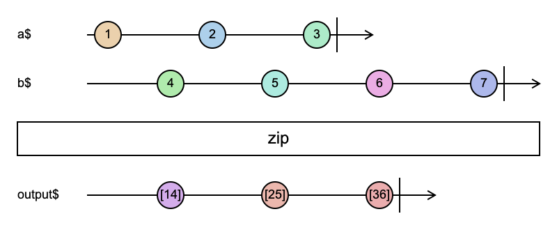

# zip

```typescript
zip(...args: unknown[]): Observable<unknown>
```



zip 会将多个数据流按照顺序合并成一个流，并且按照顺序一对对发射

1. 就像拉链一样，按照顺序结对发射（这里跟 combineLatest 有根本上的区别）
2. 任意一个数据流完成时，都会等待最后一次结对，一旦结对完成，zip 就会完成

### 使用例子

```typescript
import { zip, of } from 'rxjs';

const a$ = of(1, 2, 3);

const b$ = of(4, 5, 6, 7); // 注意这里的 7 会被丢掉

const output$ = zip(a$, b$);

output$.subscribe({
  next(x) {
    console.log(x);
  },
  complete() {
    console.log('complete');
  },
});

// [1, 4]
// [2, 5]
// [3, 6]
// 'complete'
```

参考资料：

- [zip](https://rxjs.dev/api/index/function/zip)
- [弹珠图](https://swirly.dev/#?code=-1----2----3%7C%20%0Atitle%20=%20a$%20%0A%0A----4----5----6----7%7C%20%0Atitle%20=%20b$%20%0A%0A%3E%20zip%20%0A%0A----a----b----c%7C%20%0Atitle%20=%20output$%0Aa%20:=%20%5B14%5D%20%0Ab%20:=%20%5B25%5D%20%0Ac%20:=%20%5B36%5D)
